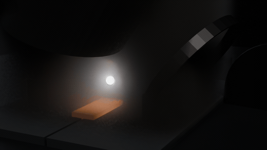
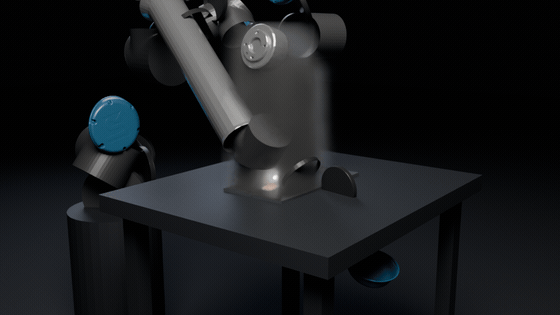
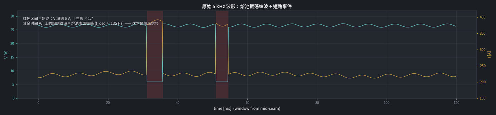
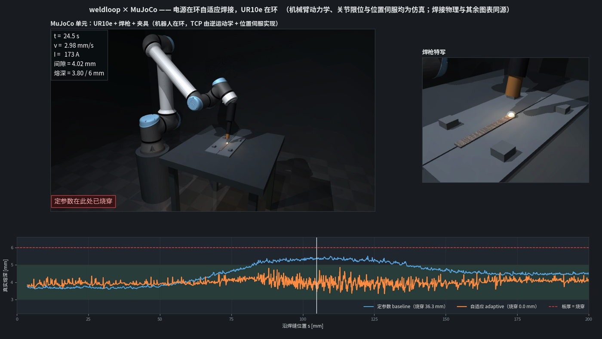
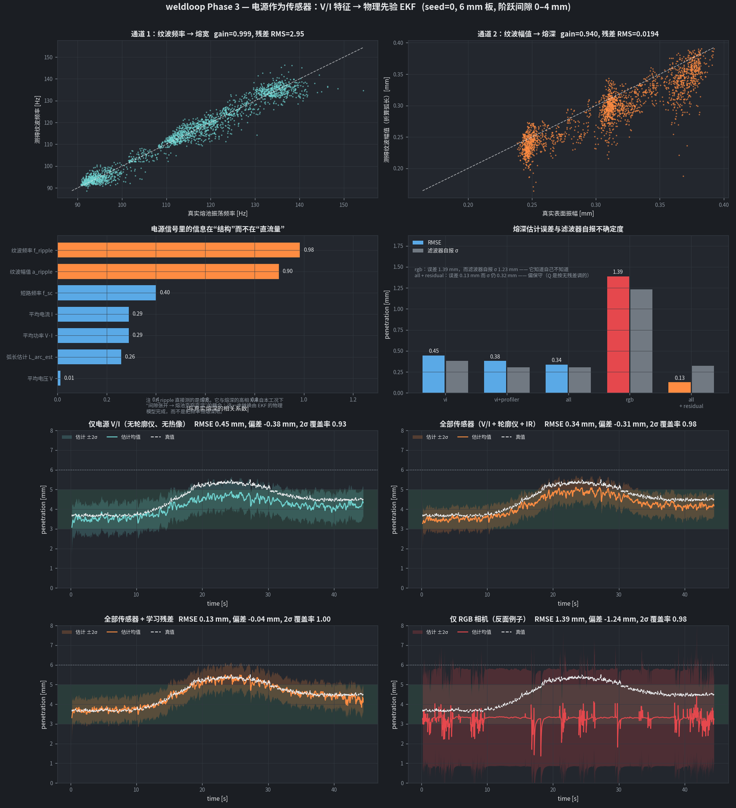
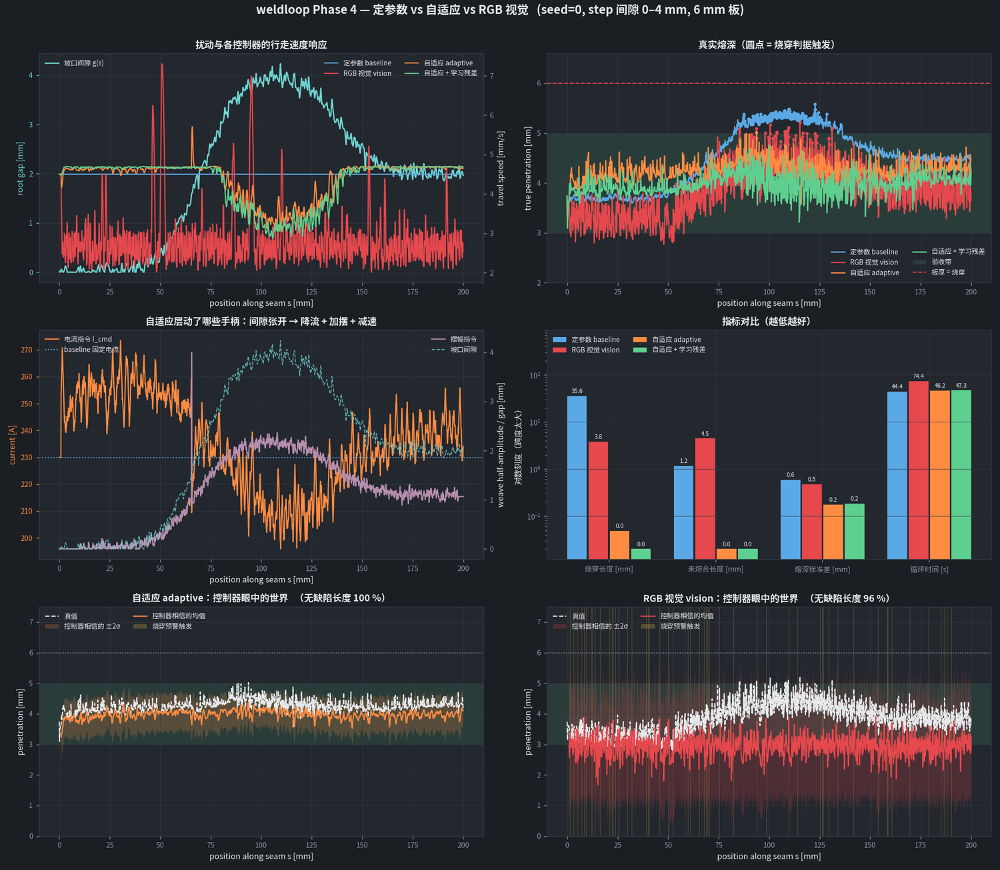
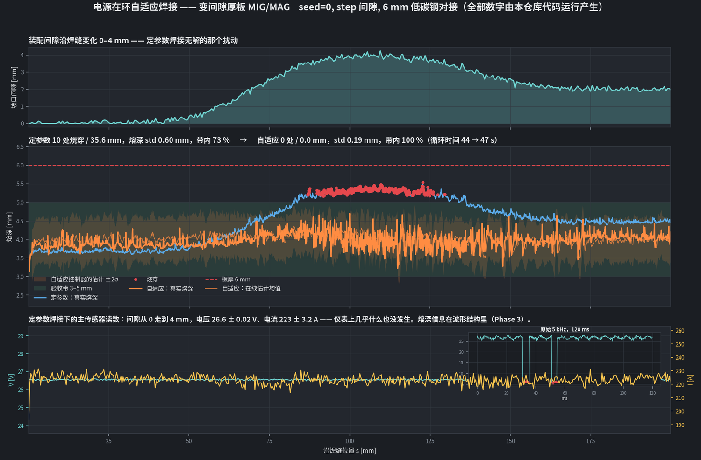
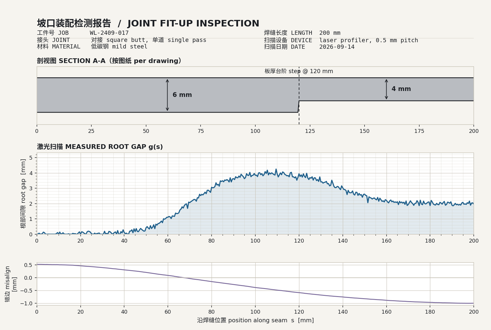
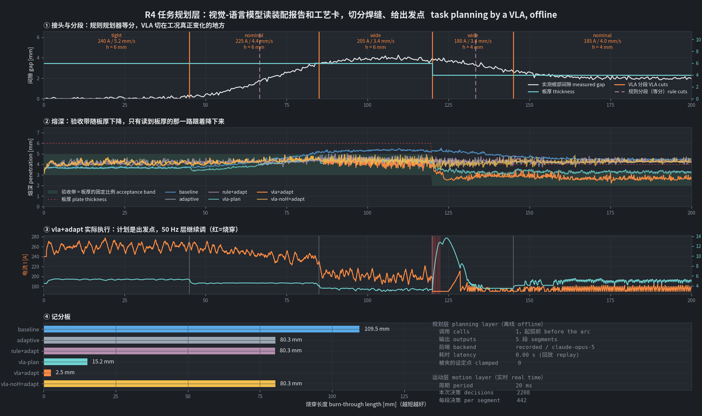

# weldloop

变间隙厚板 MIG/MAG 的自适应焊接仿真。用焊接电源本身当主传感器，不用相机。

纯仿真，没有硬件依赖，笔记本上一条命令跑完。

```bash
pip install -e .
python scripts/run_demo.py --seed 0 --gap-profile step   # ~28 s
```

<p align="center">
  
  
</p>

上面两段是 Blender Cycles 渲的，机械臂是 MuJoCo 里的 UR10e，画面里的数字全部来自仿真日志。
完整视频见 [Releases](../../releases)。

几个可能最先想问的：
[为什么电信号会知道熔池的事](#why-vi)（整套方案的技术前提）、
[这个想法有没有文献支持](#prior-art)（有，但有一条重要保留意见）、
[为什么端到端视觉策略在这儿不行](#vla)、
[物理建模和 world model / 学习策略怎么接起来](#roadmap)。

---

## 问题

厚板对接的现场情况是装配间隙沿焊缝一直在变。切割公差、点固变形、工装重复性加起来，
根部间隙在 0–4 mm 之间晃。一套固定参数：

- 间隙张开的地方，电弧下面少了母材这个散热体，同样热输入挖得更深，熔池托不住，烧穿；
- 间隙收紧的地方，同样的送丝量塞进更小的坡口，余高过大；速度补过头又变成未熔合。

想在线补偿，就得知道熔池现在多深。问题就卡在这儿：

| | 电弧燃烧时为什么靠不住 |
|---|---|
| 可见光相机 | 烟尘挡、弧光过曝。本仓库实测 74 % 的帧不可用，勉强可用的帧熔宽误差 7.97 mm（熔池才 11 mm 宽） |
| 红外热像 | 能透过烟尘，但只给表面温度和熔宽，给不了深度 |
| 激光轮廓仪 | 看的是坡口几何，不看熔池；还会被飞溅打丢帧 |
| 超声 / 射线 | 在线做不到 |

熔深、熔宽、热输入、冷却速率都测不到。这是个状态估计问题，不是传感器选型问题。

### 为什么这件事比看上去难

不止是"传感器不好使"。这个任务几乎把所有让控制变难的因素凑齐了。

**要控的量在金属里面。** 熔深是熔合线到板面的距离，在已经凝固的金属内部。
就算给一台完美的相机、零烟尘零弧光，它也只能看到熔池表面。这不是分辨率或算法问题，是几何问题。
表面能给你熔宽和温度，给不了深度。

**时间尺度跨了六个数量级。** 熔滴过渡 μs–ms，电弧几 ms，熔池 100 ms，
热场几秒，变形几分钟。控制器必须挑对层：在 ms 层上调熔深是没用的（熔池还没反应过来），
在秒层上防烧穿是来不及的（洞已经烧穿了）。

**失败不可逆。** 烧穿是一个洞。不能重试，不能回退，工件可能已经过了几十道工序。
这跟抓取失败重抓一次完全不是一回事。

**标注极贵。** 真值要靠破坏性金相截面，一条 200 mm 焊缝切二三十刀。
现实的数据规模是几百到几千条焊缝，不是几百万条轨迹。

**过程非平稳。** 每个坡口的装配都不一样，导电嘴会磨，保护气流量会漂，板材批次有差异。
在 A 工件上调好的参数，到 B 工件上不一定对。

**结果要能被认证。** 焊缝是按标准评定的，要出工艺评定报告。
一个说不清为什么这么动的黑箱策略很难过评审。不确定度和可解释性在这里是硬要求，不是加分项。

<a id="vla"></a>

### 为什么直接上端到端视觉策略（VLA）不行

这是我们真正想清楚的一件事，因为它决定了整个技术路线。

1. **观测在最需要的时候被破坏。** VLA 的前提是相机看得见任务。
   电弧一燃，烟尘和弧光就把这个前提拿走了——本仓库实测 74 % 的帧不可用。
   模型不是看不清，是看不见。
2. **就算看得见，也看不到要控的量。** 熔深在金属内部。像素再多也给不了。
   一个在像素上端到端训练的策略，最好的情况也只是学到"表面长这样时，熔深大概多少"，
   而那个映射恰恰依赖于间隙、板厚、散热条件，也就是最容易分布外的那些变量。
3. **速率对不上。** VLA 推理几 Hz，熔池响应 100 ms，烧穿 1 s 内完成。
   决策周期比被控过程慢一个数量级的控制器，只能事后补救。
4. **数据规模对不上。** VLA 靠大规模演示数据。这里每一条标注都要切片，
   而且"什么是好焊缝"的判据本身就依赖破坏性检验。
5. **失败代价和认证。** 前面说过，不重复。

把这五条放一起看，结论不是"学习方法在焊接上没用"，而是：

> 这些都是观测和数据的问题，不是策略类的问题。
> 所以正确的做法不是放弃学习，是先把观测修好，再在修好的观测上学。

这就是本仓库在做的事。

要说清楚的是，这五条针对的是**把视觉策略放进实时回路**。
放在秒级的任务层是另一回事，那一层已经实测跑通了：[VLA 放在任务层](#vla-demo)。

## 设定

| | |
|---|---|
| 工艺 | GMAW，实心焊丝 φ1.2 mm，恒压逆变电源 |
| 母材 | 低碳钢 Q235 级，板厚 6 mm，单道方形对接 |
| 扰动 | 根部间隙 g(s) = 0–4 mm，支持 step / ramp / sine / random / constant |
| 标称参数 | 230 A / 26.5 V / 4.5 mm·s⁻¹ / 6.88 m·min⁻¹，在零间隙处合格 |
| 验收 | 熔深 3.0–5.0 mm，目标 4.0 |
| 传感器 | 电源 5 kHz，激光轮廓仪 30 Hz，IR 30 Hz，电弧麦克风 20 kHz，测力 1 kHz，RGB 30 Hz |

多道厚板是同一个控制问题按道重复，这里先做单道。

## 怎么做的

一句话：**用物理把一个"不可观测、且传感器被遮蔽"的问题，
变成一个"低维、可观测、带标定不确定度"的状态估计问题。**

具体是三步：

1. 找一个在电弧燃烧时不会瞎的传感器。只有焊接电源符合，
   [为什么电信号会知道熔池的事](#why-vi) 那节讲了机理。
2. 找到电源信号里真正带熔深信息的那部分（不是直流量，是波形结构），
   再用一个降阶物理模型把它和熔池状态联系起来。
3. 用 EKF 把这些测量融合成一个 4 维状态加协方差，交给控制器。

做完这三步之后，控制问题就从「在像素上端到端学」变成了
「在一个 4 维、带不确定度的状态上做控制」。后者有一百种成熟做法，
而且是可以被评审、被认证的。现在接的是一个可解释的 PI 加安全外推；
将来接世界模型或者学习策略也一样，因为接口是同一个状态空间，不用回到像素。
见 [路线图](#roadmap)。

<a id="why-vi"></a>

### 为什么电信号会知道熔池的事

这是整套方案最重要的技术前提，值得单独讲。任何懂焊接的人第一反应都是
"平均电流跟熔深的关系很弱啊"——这个反应是对的，下面解释为什么它不影响结论。

**电弧本身就是电路的一部分，而电弧的几何由熔池表面决定。**

不是"电信号跟熔池有统计相关性"，是熔池的形状直接出现在电路方程里：

```
V = V_0 + E_a · L_arc + R_so(伸出长度) · I

L_arc = (导电嘴到工件距离 − 伸出长度) + 熔池下陷(p) + a_osc·sin(2π f_osc t)
                                        ↑            ↑
                                    熔深压下去的    熔池自己在晃
```

电弧的下端点不是板子表面，是**液态金属的表面**。那个面被电弧压力压出一个凹坑，
深度随熔深走，而且它一直在晃。所以熔池的几何是一个串在回路里的电路元件。
`E_a = 1600 V/m`，弧长变 1 mm，电压就变 1.6 V。

这是电路拓扑，不是经验拟合。相机要**看**熔池，电源是**接**在熔池上。

**但直流量确实不行，这一层必须先承认。**

- 质量守恒钉死电流：稳态下送丝量 = 熔化量，熔化律 `v_wire = a·I + b·L_so·I²`
  反过来把 I 钉在送丝速度上；
- CV 机器钉死电压：设定多少就是多少。

熔池变深、下陷变大、弧长想变长，但 CV 环会让伸出长度去吸收它（这就是自调节），
而伸出长度本身没人直接测。熔池的变化被吞进一个不可观测的状态里。

实测：间隙从 0 走到 4 mm，电压 26.6 ± 0.02 V，电流 223 ± 3.2 A。仪表上什么都没发生。
所以"用电源当传感器"如果理解成看平均电流，是行不通的。

**活下来的是动力学。**

熔池是一坨被表面张力兜住的液态金属，有自己的固有振荡。表面张力主导的振荡是经典标度，
池子越大晃得越慢；振幅随液体量和过热度增长，跟深度挂钩：

```
f_osc = C_osc · sqrt(γ / (ρ·(w/2)³))         → 熔宽    实测增益 0.999，残差 2.95 Hz
a_osc = k_a · p · (1 + k_T · 过热度)          → 熔深    实测增益 0.940，残差 0.019 mm
f_sc  = f_max · bell(I) · exp(-k·L_arc/a_osc) → 两者都沾一点，很弱
```

这个振荡调制瞬时弧长，于是调制电压：

| 工况 | 熔宽 | 熔深 | f_osc | 表面振幅 | 电压纹波 |
|---|---|---|---|---|---|
| 零间隙 | 13.0 mm | 3.7 mm | 90 Hz | 0.26 mm | 0.41 V |
| 4 mm 间隙 | 10.3 mm | 5.5 mm | 128 Hz | 0.38 mm | 0.61 V |

**0.4 V 的纹波怎么从 0.35 V 的噪声里挖出来。**

单样本信噪比 1.2，没法用。但纹波是相干的，它在一个确定频率上，噪声不是。
200 ms 窗口在 5 kHz 下有 1000 个样本，相干积分后：

```
幅值估计精度 = 0.35 V × sqrt(2/1000) = 0.0157 V = 9.8 µm 弧长
```

实测 `a_ripple` 残差 19 µm，基本跑到噪声极限了。窗口长度就是拿来换信噪比的，
这也是估计器要在 5 kHz 原始波形上做 FFT 而不是用面板平均值的原因。

**为什么电源自己没把它压掉。**

电源电流环时间常数 8 ms，转折频率 20 Hz。熔池振荡在 90–128 Hz，高出 5.5 倍，机器跟不上。

而且这不是巧合。真实逆变电源的"电感 / 电弧力"设定就是**故意**限制这个带宽的，
否则机器会去追电弧的每一次抖动，过渡会变得很难看。
换句话说，电源为了自己工作得好，恰好把我们要的信号留了下来。

**在数据上的确认。**

把上面的机理走一遍，落到相关系数上（seed=0，200 mm 阶跃间隙焊缝）：

| V/I 特征 | 与真实熔深的相关系数（绝对值） |
|---|---|
| 纹波频率 f_ripple | 0.98 |
| 纹波幅值 a_ripple | 0.90 |
| 短路频率 f_sc | 0.40 |
| 平均电流 | 0.29 |
| 平均电弧功率 | 0.29 |
| 平均电压 | 0.01 |



上图是原始波形。红色区间是短路，V 塌到 6 V、I 冲高 1.7 倍；
其余时间 V/I 上那圈规则纹波就是熔池振荡。

还有两条次要通道。短路发生在晃动的熔池表面够到焊丝尖端的时候，
所以短路率是（弧长, 振幅）的函数，是同一个状态的另一个视角——本仓库在 230 A 熔滴过渡下
实测它几乎没信息（噪声 9.7 Hz vs 信号变化 3.1 Hz），但短路过渡或 CMT 下它会变成主力。
另一条是用已知伸出长度电阻把 V/I 反解成弧长，也就是成熟的 through-the-arc 传感，
工业上做焊缝跟踪已经在用。

**工程上的理由，其实同样重要。**

- 它已经在那儿了。每台逆变电源为了自己的控制环本来就在 kHz 采 V 和 I。
  不用加硬件，没有镜头要擦，没有窗口会被飞溅打花。
- 它不会被遮挡。烟尘、弧光、飞溅都是光学问题，电流走的是金属。
- 它快。kHz 对 30 Hz。熔池响应 100 ms，kHz 留了充足余量，还允许用频谱特征；
  相机 30 Hz 连 100 Hz 的振荡都采不到，欠采样。
- 它天然同步，因为它就是过程本身，不存在相机时间戳对不对得上的问题。
- 对逆变电源厂商来说，这个传感器是自己的产品，差异化落在自家硬件里而不是别人的相机上。

**边界。**

- 这是**间接**测量。电源给的是熔宽和一个与深度相关的振幅，不是深度。
  把它变成熔深的是那个降阶物理模型。模型错了，估计就错了。
  这也正是仓库里还留着 EKF、协方差、轮廓仪和 IR 的原因：单靠 V/I 是 0.45 mm，全部加上是 0.34 mm。
- 它被很多东西干扰。伸出长度漂移、导电嘴磨损、保护气流量、板材批次都会动 V/I。
  仓库把这些做成估计器不知道的慢漂移（OU 过程），就是为了不让结论虚高。
- **标度律本身需要实验验证。** 表面张力振荡是真实现象，通过电弧感知熔池振荡也是已有的研究方向，
  但本仓库里的 `C_osc` 和 `k_a_osc` 是构造出来的，取值只保证演示自洽。
  文献依据、以及文献里对 GMAW 的一条重要保留意见，都写在
  [相关工作](#prior-art)；怎么验写在 [振荡通道要单独验一次](#osc-check)。
- 纯喷射过渡、熔池很稳的工况下纹波可能很弱。这时候要么换工艺（脉冲会主动制造可观测的扰动），
  要么更依赖几何和热像。

<a id="prior-art"></a>

### 相关工作，以及这个想法是从哪来的

**来源，说实话。** 不是从文献里读来的，是建模过程中推出来的。
最初的假设是"平均电弧功率和短路频率能跟上熔深"。实现了真实的 CV 自调节之后，
仿真直接给出 26.6 ± 0.02 V / 223 ± 3.2 A 横跨 0–4 mm 间隙——原假设在自己的模型里就不成立。
熔池表面振荡是为了让"电源当传感器"这个命题还能活下去而找的机制：
电弧下端点是液面，液面在晃，晃动就进了电路方程。写完之后才去查文献。

查下来的结论是：**机理对应一条真实且发展得相当成熟的研究线，但我的实现落在它覆盖最薄的工况上。**

**文献支持的部分**

- **GTAW 上是成熟工作。** Xiao 与 den Ouden（代尔夫特，1990 年代初）用电弧电压连续测量加在线 FFT
  得到熔池振荡频率，发现部分熔透的振荡频率明显高于全熔透，并提出以此作为熔深在线传感与控制的基础。
  这跟 `features.py` 做的事（电压 → 消隐短路 → FFT → 频率/幅值）是同一套。
- **频率与尺寸的方向一致。** 短路过渡 GMAW 的研究报告"熔池振荡频率随熔池尺寸增大而降低"，
  且"振荡频率可从电弧电压数据测得，由熔池几何与液态金属物性决定"。
  对应本仓库的 `f_osc ∝ sqrt(γ/(ρR³))`。
- **幅值与熔深的方向也一致。** 脉冲 GMAW 的研究报告"熔池振荡幅值随熔深减小而减小"，
  且部分熔透转全熔透时频率成分和幅值都出现突变；短路过渡的研究同样报告全熔透熔池
  "振幅更高、频率更低"。对应 `a_osc ∝ p`。
- **GMAW 里不需要额外激励。** 熔滴过渡本身就在敲熔池，短路过渡里是液桥爆断的"表面冲击"。
  （GTAW 那条线通常要主动脉冲电流去激励熔池。）

**文献不支持、甚至反对的部分**

这一条更重要，先写在前面免得被当成隐瞒：

- **在 GMAW 里电压可能丢掉频率特征。** 脉冲 GMAW 的研究明确写到，电压信号曲线
  "由于熔池表面曲率而丢失了熔池的振荡频率特征"，作者最后退回去用基值期电压波动幅值的突变来判熔透；
  另有报告指出峰值电流期焊丝端部熔滴的长大与振荡显著影响弧长，使电压不能准确反映熔池高度。
  **也就是说，本仓库最强的那条通道（`f_ripple`，相关系数 0.98）恰好是 GMAW 文献里最难从电压拿到的。**
- **多数 GMAW 研究用高速摄影测振荡**，电弧电压是次要且更难的通道。
- **工况覆盖最薄的恰好是我们这个。** 文献覆盖 GTAW（最干净）、脉冲 GMAW、短路过渡 GMAW；
  本仓库是 CV 连续 + 熔滴过渡（230 A globular）。
- `C_osc`、`k_a_osc`、`k_osc_T`、`k_sag` 全是构造的，取值只保证演示自洽。

**所以把这个风险量化了一遍**

既然文献说频率通道在 GMAW 里可能拿不到，那就直接把它从滤波器里拿掉看损失多少。
`all-no-f` 和 `vi-no-f` 是仓库里的正式消融项，`tests/test_ekf.py` 里有对应测试：

| 传感器组合 | 熔深 RMSE | σ_p | 熔宽 RMSE | σ_w |
|---|---|---|---|---|
| 全部（含 f_ripple） | 0.336 mm | 0.305 | 0.204 mm | 0.364 |
| 全部，去掉 f_ripple | 0.330 mm | 0.308 | 0.288 mm | 0.472 |
| 仅 V/I（含 f_ripple） | 0.446 mm | 0.380 | 0.234 mm | 0.689 |
| 仅 V/I，去掉 f_ripple | 0.348 mm | 0.820 | 1.473 mm | 3.504 |

**熔深精度几乎不依赖频率通道。** 深度信息主要由 `a_ripple` 承载；`f_ripple` 约束的是熔宽——
拿掉它熔宽 RMSE 从 0.23 涨到 1.47 mm、σ_w 涨到 3.5 mm，而熔深 RMSE 反而从 0.446 降到 0.348
（没有轮廓仪、间隙假设为 0 时，频率通道会把宽度往模型不自洽的方向拉，反过来偏了深度）。
而且滤波器诚实地把 σ_p 从 0.38 抬到 0.82 mm，它知道自己少了一条腿。

文献指出的那个风险，恰好落在我们不那么依赖的那条通道上。
这不是设计时想到的，是查完文献回头测出来的——但它确实把方案的下限抬高了不少。

**参考**

- Xiao & den Ouden 的 GTAW 熔池振荡工作（电弧电压 + FFT 判熔透），见后续文献中的引述与综述：
  [The oscillation of stationary weld pool surface in GTA welding](https://www.sciencedirect.com/science/article/abs/pii/S0924013618300190)、
  [Monitoring weld pool oscillation using reflected laser pattern in GTAW](https://www.sciencedirect.com/science/article/abs/pii/S0924013618300384)
- [Study on Penetration Sensing Method Based on Pool Oscillation and Arc Voltage during Pulsed GMAW, Appl. Sci. 2020](https://doi.org/10.3390/app10082735)
  （幅值随熔深变化；电压丢失频率特征）
- [Study on the Oscillating Phenomenon of Welding Pool with Different Penetration States in Short-Circuiting GMAW, Appl. Sci. 2023](https://doi.org/10.3390/app13116370)
  （频率随熔池增大而降低；全熔透振幅更高频率更低）
- [Study on the weld pool oscillation behavior during pulsed GMAW](https://www.sciencedirect.com/science/article/abs/pii/S1526612522007009)
- [Real-time seam penetration identification in arc welding based on fusion of sound, voltage and spectrum signals](https://link.springer.com/article/10.1007/s10845-014-0971-y)
- [The Oscillation Behaviour of Liquid Metal in Arc Welding](https://www.scientific.net/MSF.539-543.3877)

热源与熔化率部分：Rosenthal(1946) 移动点热源、Goldak(1984) 双椭球热源，按名引用不引用其参数。

### 三层控制

```
秒–分钟   任务规划    planning/vla.py            图纸/工艺卡/装配扫描 → 分段 + 初始工艺窗口（离线）
10–100 ms 运动层      control/motion_layer.py    速度 / 摆幅 / 电流设定值，消费估计的均值和协方差
~2 ms     电源内环    control/inner_loop.py      送丝给电流，设定电压给弧长
0.2 ms    被控对象    sim/cell.py                电源自调节 + 电弧 + 降阶熔池
```

三个尺度是真的分开跑的：0.2 ms 的 DAQ 回调往特征缓冲里推 5 kHz 波形，2 ms 的内环整定电气设定值，
20 ms 的运动层重新决策。

### 估计器

四状态降阶熔池 ODE（`physics/melt_pool.py`）：`x = [T_pool, 熔宽, 熔深, 填充率]`，
结构借自 Rosenthal(1946) 和 Goldak(1984)，系数全是集总标定常数。外面套 EKF，
可选再加一个小残差网络。

几个不太显然但很要紧的处理：

- 过程模型故意跟被控对象不一致（`config.model_mismatch`，系数扰 5–12 %），
  代表用有限真实数据辨识后剩下的参数误差。不这么做，估计器就是拿仿真器自己的模型解自己的题。
- R 由数据辨识，不是拍脑袋给的。
- 特征窗长 200 ms、步长 20 ms，相邻窗共享 90 % 样本。当成独立测量会让协方差按 √N 假性收缩，
  这就是"自信地错"的来源。R 按重叠倍数放大。
- 坡口间隙是模型输入，不是测量。轮廓仪不观测熔池，间隙错了新息纠正不了，只会污染预测。
  所以它的不确定度要显式传播进协方差。

### 运动层

| 手柄 | 干什么 |
|---|---|
| 电流（经送丝） | 熔深的主要权限。PI 跟目标，band 违规项权重是跟踪项的 2 倍 |
| 行走速度 | 生产率。只在整个 ±kσ 区间都在验收带内、且电流环还有余量时才提速，上限被填充能力卡死 |
| 摆幅 | 桥接间隙、润湿两侧坡口、缓解过熔深 |

提速量正比于置信区间到验收带边缘的余量。区间越宽余量越小，就不提速。
保守不是额外加的规则，是从目标函数里掉出来的。

另有一条硬安全：把当前估计用过程模型外推 0.25 s，预测熔深（含 σ 裕度）触到 0.85×板厚就
立刻提速 + 降流 + 满摆，绕开 PI。

### 机器人在环（可选）

`sim/mujoco_cell.py` 在 MuJoCo 里搭了单元：Menagerie 原版 UR10e、焊枪、工作台、夹具、工件。
它实现同一个 `RobotBase`：

```python
robot = MujocoRobot(cfg, seam)
simulate(cfg, controller=..., robot=robot)   # 其它一行不用改
```

指令路径还是从控制器的行走速度积分来，阻尼最小二乘微分逆解转成关节目标，MuJoCo 用自己的
执行器动力学积分手臂，然后把实际到达的 TCP 反投影回焊缝交给焊接物理。跟踪误差和伺服滞后
会真的传到熔池。



## 结果

下面的数字都是跑出来的。`out/metrics.json` 里有全套。

### 熔深估计

seed=0，200 mm 阶跃间隙焊缝：

| 传感器组合 | 熔深 RMSE | 偏差 | 自报 σ | 2σ 覆盖率 |
|---|---|---|---|---|
| 仅电源 V/I | 0.446 mm | −0.384 | 0.380 | 0.93 |
| V/I + 轮廓仪 | 0.380 mm | −0.350 | 0.306 | 0.95 |
| 全部（V/I + 轮廓仪 + IR） | 0.336 mm | −0.308 | 0.305 | 0.98 |
| 仅 RGB（对照组） | 1.388 mm | −1.240 | 1.231 | 0.98 |
| 全部 + 学习残差 | 0.127 mm | −0.036 | 0.321 | 1.00 |

三点：

1. 只用电源就已经能用，0.45 mm，没有相机也没有轮廓仪。这是整个方案的主张。
2. 加传感器协方差单调收缩（σ_w 0.69 → 0.44 → 0.36 mm），滤波器确实知道自己知道得更多了。
3. RGB 那一行：误差 1.39 mm，熔深本身才 3–5.5 mm。但它自报 σ 1.23 mm，
   诚实地说"我不知道"，而不是自信地错。这个性质对消费协方差的控制器很重要。

还有一组消融没放进上表：把纹波**频率**通道整个拿掉（文献提示这在 GMAW 里可能拿不到），
熔深精度几乎不变，代价是熔宽估计变差。数字和理由在 [相关工作](#prior-art)。



### 控制

| 控制器 | 烧穿孔洞 | 烧穿长度 | 未熔合 | 熔深 std | 在带内 | 无缺陷长度 | 循环时间 |
|---|---|---|---|---|---|---|---|
| 定参数 | 10 | 35.6 mm | 1.2 mm | 0.60 mm | 73.4 % | 82.2 % | 44.4 s |
| RGB 视觉 | 3 | 3.8 mm | 4.5 mm | 0.47 mm | 96.6 % | 95.9 % | 74.4 s |
| 自适应 | 0 | 0.0 mm | 0.0 mm | 0.18 mm | 100 % | 100 % | 46.2 s |
| 自适应 + 残差 | 0 | 0.0 mm | 0.0 mm | 0.19 mm | 100 % | 100 % | 47.3 s |

五条不同 seed、不同间隙分布的焊缝平均（step×2 / ramp / random / sine，150 mm）：

| 控制器 | 孔洞数 | 烧穿长度 | 熔深 std | 在带内 | 循环时间 |
|---|---|---|---|---|---|
| 定参数 | 4.0 | 7.9 mm | 0.45 mm | 79.0 % | 33.3 s |
| 自适应 | 0.0 | 0.1 mm | 0.19 mm | 99.2 % | 33.3 s |
| RGB 视觉 | 0.0 | 0.3 mm | 0.38 mm | 99.1 % | 54.8 s |

烧穿长度降到 1/79，熔深标准差减半，在带内从 79 % 到 99 %，循环时间一样。

RGB 那一路的结论要说准：它没把焊缝焊废，是慢了 65 %。它的熔深估计偏 1.2 mm、自报 σ 也是
1.2 mm，于是提速条件几乎永远不成立，只能爬着走，换来的还是更差的熔深控制和 24 倍的未熔合长度。
对照是干净的——同一套控制律、同一个 EKF、同样的协方差处理，只有进滤波器的测量不一样。



### 换成真实机械臂还成立吗

| | 行走速度伺服 | UR10e 在环 |
|---|---|---|
| 定参数烧穿长度 | 35.6 mm | 36.3 mm |
| 自适应烧穿长度 | 0.0 mm | 0.0 mm |
| 自适应熔深 std | 0.19 mm | 0.18 mm |
| 自适应在带内 | 100 % | 100 % |
| 循环时间 | 47.3 s | 48.1 s |
| TCP 跟踪误差 | — | 0.006–0.056 mm |

成立。2 Hz、±2 mm 的摆动对工业臂本来就不难，但算出来比写一句"机器人应该跟得上"有用。

### 一页图

`scripts/run_demo.py` 出的那张，给幻灯片用：



底下那一栏是问题陈述本身：间隙走了 4 mm，电压电流没动。

其它自检图：[物理](docs/physics.png)｜[传感器](docs/sensors.png)｜[仪表板](docs/dashboard.png)

<a id="vla-demo"></a>
## VLA 放在任务层：实测

[前面那节](#vla)说的是不能把视觉策略放进实时回路。任务层是另一回事。
这一节把路线图里的 R4 真的跑起来了：`scripts/run_vla_demo.py`。

### 这个活是什么

一条 200 mm 对接焊缝，前 120 mm 是 6 mm 板，之后是 4 mm 板。
板厚台阶是机加工出来的，写在图纸上，激光轮廓仪测不到——轮廓仪测的是根部间隙。
间隙自己也在变：0–45 mm 基本贴合，中段张到 4 mm，后段回到 2 mm。
两件事的位置并不重合，这是这条缝麻烦的地方。

规划层拿到的东西和车间里现成的一样，就两份：

- 一张**装配检测报告图**，激光扫描的间隙曲线加图纸剖视；
- 一份**工艺卡文本**，里面有板厚台阶、机器窗口、验收规则和车间备注。

间隙数据只在图里，不在文字里。板厚只在文字和剖视里，不在扫描里。



验收规则是按比例写的：熔深不低于板厚的 50 %，不高于 83 %。
6 mm 段是 3.0–5.0 mm，4 mm 段是 2.0–3.3 mm。
把厚板段的毫米数照抄到薄板段上，验收带比板本身还厚。

模型只被要求做一件事：把焊缝切成几段，每段给一个出发点和一条验收带。
不给它波形，不给它相机，也不让它在起弧之后说话。
prompt 和 schema 在 `planning/prompt.py`，两页，可以直接拿给工艺工程师看。

### 它给了什么

```
seg   s [mm]     class     I [A]  v [mm/s]  weave  h [mm]   band [mm]
  0    0-45      tight     240.0      5.20   0.00     6.0   3.00-5.00
  1   45-85      nominal   225.0      4.40   1.00     6.0   3.00-5.00
  2   85-120     wide      205.0      3.40   2.20     6.0   3.00-5.00
  3  120-145     wide      180.0      3.40   2.40     4.0   2.00-3.30
  4  145-200     nominal   185.0      4.00   1.30     4.0   2.00-3.30
```

段边界落在 45 / 85 / 120 / 145 mm：间隙开始张开、张到平台、板厚台阶、间隙收回。
规则规划器切在 67 / 133 mm，因为它是等分的。

它读图之后自己写的那段话里有一句是关键的：宽间隙平台跨过了板厚台阶，
120–145 mm 是薄板和宽间隙同时出现的位置，也正是车间备注里说上一批烧穿的位置。
这句话不是从间隙曲线里算出来的，是把图和文字对起来才有的。

### 结果

同一条焊缝，同一个种子，六条臂：

| 控制 | 烧穿长度 | 未熔合 | 熔深 mm | 带内 | 无缺陷长度 | 节拍 |
|---|---|---|---|---|---|---|
| baseline 定参数 | 109.5 mm | 1.2 mm | 4.49 ± 0.60 | 41.4 % | 45.2 % | 44.4 s |
| adaptive 只有闭环 | 80.3 mm | 0.0 mm | 4.26 ± 0.18 | 60.9 % | 59.9 % | 46.2 s |
| rule+adapt 规则分段（全量扫描）+ 闭环 | 80.3 mm | 0.0 mm | 4.26 ± 0.18 | 60.6 % | 59.9 % | 45.9 s |
| vla-plan 只有计划，开环 | 15.2 mm | 0.0 mm | 3.68 ± 0.42 | 85.9 % | 92.4 % | 49.1 s |
| **vla+adapt 计划 + 闭环** | **2.5 mm** | 13.2 mm | 3.65 ± 0.70 | **99.3 %** | **93.0 %** | 44.3 s |
| vla-noH+adapt 消融，见下 | 80.3 mm | 0.0 mm | 4.23 ± 0.19 | 57.2 % | 59.8 % | 47.9 s |



带内比例是按每一点的实际板厚算的，不是按 6 mm 算的——不然薄板段会被判成"熔深偏浅但合格"。

### 关键的对照

`vla-noH+adapt` 是这一节里唯一重要的一条对照。
它拿的是**同一份计划**：同样的分段，同样的电流、速度、摆幅，一个数都没改。
只改了一件事——每段的板厚按工艺卡的名义值填 6 mm，也就是"没读那句话"。

烧穿从 2.5 mm 回到 80.3 mm，和完全没有计划一样。

所以这一节的收益不是模型算得准，是**工艺卡里一句话走到了烧穿保护那里**。
可以从另一边验证同一件事：规则规划器拿到的是全量实测间隙曲线，
比模型看的那张图精确得多，它的结果还是 80.3 mm；
把它的段数从 3 调到 6，仍然是 80.3 mm。
信息不在扫描里，切得再细也变不出来。

### 代价

`vla+adapt` 有 13.2 mm 未熔合，其中 11.7 mm 是填充不足，集中在 120–140 mm，
填充率一度掉到 0.27。原因很清楚：板厚台阶上烧穿预测触发了
（薄板段 13 % 的控制周期在应急分支里），应急分支的动作是提速降流，
副作用就是那一小段没填满。它用一个较轻的缺陷换掉了一个较重的，这是设计里写好的取舍，
但代价是实打实的。

规划器自己在风险列表里点了这个边界，说参数跳变大、边界又压在台阶上、挪不动。
它说对了失效位置，没有避开失效本身——一个更好的计划应该在台阶**之前**插一小段过渡，
提前把参数降下来，而不是等台阶到了让保护去救。这是下一版规划的事。

### 为什么它还是不在回路里

不是因为不放心，是结构上就进不去：

- 规划层在这条缝里被调用 **1 次**，起弧之前；运动层做了 **2208 次**决策，
  每段 442 次。`tests/test_vla.py` 里有一条测试就是拿计数后端断言起弧之后没有再调过。
- 计划进实时回路的方式是一次 `searchsorted`。没有网络，没有模型，没有可变延迟。
- 每一个设定点在起弧前都过 `Nominal.clamped`：超出机器窗口的被夹到边界，
  验收带深过板厚的被压回去，板厚本身也有合理区间。被夹了什么会记进 trace，
  这一次是 0 条，但"0 条"是量出来的，不是假设的。

本机没有 API key，所以回放路径量到的延迟是 0.00 s，不是真实调用的延迟。
这个结论不依赖那个数：运动层 20 ms 一拍，任何一次网络往返都排除在外。

### 怎么跑

```bash
python scripts/render_fitup_scan.py   # 重新生成那张检测报告图（输入，不是结果）
python scripts/vla_plan.py            # 只跑规划层，打印分段表和风险
python scripts/run_vla_demo.py        # 六条臂，约 100 s
#   out/vla_plan.png  out/vla_metrics.json
```

默认不需要 key 也不需要网络：`data/vla/` 里存了一份回答，
按 prompt、schema、工艺卡、机器窗口和扫描图的摘要做索引。
其中任何一样变了，摘要就变，旧回答会拒绝加载，规划层退回规则桩并在 trace 里写明原因。
换成真的 API 调用：

```bash
pip install anthropic && export ANTHROPIC_API_KEY=...
python scripts/vla_plan.py --live     # 调用并重新录制
```

`data/vla/plan_*.json` 里现在那份回答，是 claude-opus-5 在一次 Claude Code 会话里，
按本仓库的 prompt 和那张扫描图写出来的，**没有走 Messages API**——
生成它的机器上没有 key，也没装 `anthropic`。
它只写了一次，写完没有对着仿真结果改过；对着结果改就成了拟合，不是规划。

## 跑起来

```bash
pip install -e .
python -m pytest -q                 # 246 tests（没装 mujoco 会跳过 16 个）
python -m pytest -q -m "not slow"   # 241 tests，约 2 min

python scripts/run_demo.py --seed 0 --gap-profile step
#   out/summary.png  out/dashboard.png  out/metrics.json

python scripts/plot_physics.py      # 物理与仿真单元自检
python scripts/plot_sensors.py      # 传感器与主时钟
python scripts/plot_estimation.py   # 估计器 + RMSE 表
python scripts/plot_control.py      # 三方控制对比

python scripts/vla_plan.py             # R4 规划层，回放录好的回答，不需要网络
python scripts/run_vla_demo.py        # 规划层六条臂对比，约 100 s

python scripts/make_dataset.py --n 6   # 数据集，镜像一期采集 schema
python scripts/train_residual.py       # 可选，没有 torch 会自己跳过
```

残差没训练时演示以纯物理跑，上面 RMSE 表最后一行需要先训。

渲染：

```bash
python scripts/render_animation.py                # 俯视对比
python scripts/render_robot.py                    # matplotlib 第三人称

pip install -e ".[robot]"                         # mujoco + robot_descriptions
python scripts/render_mujoco.py                   # MuJoCo 单元，约 7 min
python scripts/render_photoreal.py --stage all    # Blender Cycles，约 60 min
```

Blender 路径写死在 `scripts/render_photoreal.py` 里，换机器要改。
这台机器上 MuJoCo 要 `MUJOCO_GL=glfw`，egl 和 osmesa 都起不来。

## 代码结构

```
weldloop/
  config.py            全部 pydantic 配置，每个数值标了来源和是否可配
  interfaces.py        SensorBase / PowerSourceBase / RobotBase，真实硬件的接缝
  metrics.py           焊缝评分：烧穿孔洞、未熔合长度、熔深 std、节拍
  physics/
    heat_source.py     Rosenthal 移动点热源、Goldak 双椭球（按名引用，不引用其参数）
    melt_pool.py       四状态降阶熔池 ODE + 烧穿/未熔合判据
    arc.py             电弧特性、熔化律、熔滴过渡、熔池振荡、短路统计
  sim/
    seam.py            间隙分布 g(s) 生成
    cell.py            5 kHz 被控对象，电源自调节是真的
    sensors.py         六个传感器，六种速率，六种失效模式
    logger.py          统一主时钟宽表，就是一期采集建议 schema
    runner.py          三个时间尺度的调度
    mujoco_cell.py     MuJoCo 单元（可选依赖）
  estimation/
    features.py        5 kHz V/I 特征：短路消隐 → 纹波频率/幅值/短路率/弧长
    ekf.py             四状态 EKF，序贯标量更新，间隙不确定度显式传播
    residual.py        可选小残差网络，没 torch 时优雅退化
    evaluate.py        离线但严格因果的传感器组合消融
  control/
    inner_loop.py      ms 级电源内环
    motion_layer.py    10–100 ms 自适应运动层
    baseline.py        定参数对照
    vision.py          RGB 视觉对照，专门用来被测出失败
  planning/
    task_planner.py    规则分段桩，定义接口和返回类型
    prompt.py          R4 的 prompt 和输出 schema，加请求摘要
    vla.py             视觉-语言规划层，可换后端，失败退回规则桩
    job.py             演示用的工艺卡文本和装配扫描
    schedule.py        计划 → 按弧长查表，起弧前全部夹到机器窗口内
  viz/                 配色、仪表板、动画、Blender 导出
```

## 模型的坑

都是已知的，不是留给读者去发现的。按对结论的影响排：

1. 熔池是四状态降阶模型，不是 CFD。Marangoni 对流、电弧压力、熔滴冲击、表面变形全被集总进
   少数系数里。改进路径是用 CFD 或热流有限元做离线高保真解，拿来重新辨识 ROM 系数，ROM 结构不动。
2. `eta_melt` 把净功率按常数比例劈成熔化和过热。可以让它随电流/过渡模式变，或者改成两状态焓模型。
3. 时间常数 `tau_A` / `tau_T` 被人为上限截断（近弧区响应比整池快）。只改瞬态不改稳态，代码里写了。
   要更好就得做"近弧小池 + 拖尾大池"的双池结构。
4. 熔池振荡模型是瑞利型标度加集总常数。需要高速摄影或激光测振去标定，还要区分部分熔透和
   全熔透的模态切换。
5. 烧穿用的是表面张力桥接判据，没解自由表面。
6. 摆动只通过宽深比建模，不解摆动周期内的过程。摆频接近熔池时间常数时这个近似会崩。
7. 没有热积累和变形。多道、层间温度、角变形都没有。走向多道厚板必须补。
8. 加了残差之后滤波器偏保守（误差 0.13 mm 而 σ 还有 0.32 mm），因为 Q 是按无残差整定的。
9. 电源是理想 CV 加熔化律，没有脉冲和 CMT。补上之后 `f_sc` 那条通道会从"几乎没信息"变成主力。
10. 传感器噪声是高斯加简单丢帧模型。

<a id="roadmap"></a>

## 路线图：物理和学习怎么结合

上面说了为什么不能直接端到端学。但这不等于这个问题里没有学习的位置——恰恰相反，
把观测修好之后，学习能落的地方反而清楚了。下面是我们想走的路，R0 已经在仓库里。

**R0 · 物理先验估计 + 残差学习（已完成）**

降阶熔池模型给结构，EKF 给融合和不确定度，一个小 MLP 学模型没抓到的那部分动力学：

```
residual = x_true(t+dt) − f_model(x_true(t), u(t), dt)
```

它修正的是动力学，不是测量。实测：一步熔深模型误差 0.141 → 0.026 mm，
闭环熔深 RMSE 0.336 → 0.127 mm，偏差 −0.308 → −0.036 mm，
在训练时没见过的焊缝上验证。这是"在物理里学"的最小版本，也是后面几步的模板：
物理负责结构和外推，网络负责那些没人愿意手写的修正项。

**R1 · 潜空间世界模型**

用真实数据在 ROM 的状态空间上学一个带不确定度的动力学模型 `p(x_{t+1} | x_t, u_t)`，
其中 `x = [T_pool, 熔宽, 熔深, 填充率]`。

为什么在 4 维潜空间而不是像素空间：像素在电弧燃烧时没有信息，而且 4 维模型的数据需求
比视频世界模型小好几个数量级——几百条焊缝就够，正好是破坏性真值能提供的规模。
R0 的残差网络已经是这个模型的退化版（只学一步、只学均值），R1 要的是多步 rollout 和分布。

**R2 · 基于世界模型的控制，再蒸馏成策略**

有了 rollout，先用模型预测控制替掉现在手写的 PI：目标函数直接写"熔深在带内、
烧穿概率低于 ε、节拍最短"，约束直接写机器和工艺的限位。输入还是那个状态加协方差。

再把 MPC 蒸馏成一个快策略。**这才是这个系统里"VLA-like"的部分**：
策略的输入不是像素，是估计出来的熔池状态、它的协方差、和轮廓仪的间隙预览；
输出是速度、摆幅、电流设定值。物理控制器留在外面当 safety shield，
学到的策略只能在物理判据算出来的安全集里动作，越界就被投影回去。
这样既拿到学习的性能，又保住可认证性。

**R3 · 跨模态编码器：把"电源当传感器"从手工特征升级成学习表征**

现在 `estimation/features.py` 里的纹波频率、纹波幅值、短路率是手工设计的。
它们能用（相关系数 0.98 / 0.90），但肯定不是最优的。

真正有意思的做法是：把 V/I 波形当作**永远在线的那个模态**，
训练一个编码器 `V/I 窗口 → 熔池状态`，监督信号来自金相截面。
跨材料、跨板厚、跨坡口形式预训练，新工况上少量数据微调。

这是本方向里 foundation model 真正能落地的地方。不是给它看视频让它学焊接，
而是在一个从不失效的一维高速信号上，学一个跨工况的过程状态编码器。
前提是 [数据采集](#data) 那节必须先做，因为监督信号只能来自破坏性真值。

**R4 · 任务层的多模态 / VLA**

秒到分钟这一层可以放心用大模型，因为它不在实时回路里：

- 读图纸、WPS、装配扫描 → 分段和初始工艺窗口。**这一条已经跑起来了，见 [VLA 放在任务层](#vla-demo)**；
- 焊后诊断：把过程日志、金相截面、无损检测报告一起喂进去做缺陷归因；
- 工艺知识的检索和迁移：换了材料或板厚，先给一个合理的起点。

### 什么该学，什么不该学

| 层 | 周期 | 现在 | 可以换成学习的 | 不该换 |
|---|---|---|---|---|
| 任务规划 | 秒–分钟 | 规则桩 + 视觉-语言规划层（R4，[已实测](#vla-demo)） | 换更强的模型、加焊后诊断闭环 | 设定点的夹取和越界记录 |
| 运动层 | 20 ms | 手写 PI + 安全外推 | MPC → 蒸馏策略（R2） | 安全判据本身，它是 shield |
| 状态估计 | 20 ms | 物理 EKF + 残差 | 残差扩成世界模型（R1）、特征换成编码器（R3） | 协方差输出，控制器要靠它 |
| 电源内环 | 2 ms | PI | — | 这层逆变电源自己做得很好，别抢方向盘 |
| 传感 | 5–20 kHz | 手工特征 | 学习表征（R3） | 电源作为主传感器这个选择 |

有两件事在整条路线上都不变：

**不确定度是接口。** 物理估计器输出的协方差既是控制器的输入，
也是"什么时候该信模型、什么时候该信数据"的开关。R1 的世界模型必须给出分布而不是点预测，
R2 的策略必须消费它，否则就回到了"自信地错"。

**物理负责样本效率和外推，学习负责修正。** 这个领域的数据规模由破坏性检验决定，
几百到几千条。在这个规模上，纯端到端学不出可靠的东西，而"物理结构 + 少量参数 + 残差网络"
正好合适。R0 这一步的证据是：残差网络只在 3 条焊缝、约 4000 个样本上训练，
就把闭环熔深 RMSE 从 0.336 mm 压到 0.127 mm，并且在没见过的 random / sine 焊缝上同样有效
（0.438 → 0.243、0.407 → 0.186 mm）。这个样本量对纯端到端方法来说根本不够。

<a id="data"></a>

## 下一步：要采什么数据

代码写完了，缺的是数据。这节讲要采什么、怎么采、采来标定哪一项。

### 哪些系数是待辨识的

`config.py` 里的数值只有两类：低碳钢教科书物性，和集总标定常数。后者没有独立物理含义，
现在的取值只保证演示落在合理焊道几何范围内。要辨识的主要是：

```
熔池     eta_arc, eta_melt, C_cond, h_conv, kappa_L, tau_A, tau_T, tau_ar, tau_f
间隙耦合 k_gap_cond, k_gap_ar
宽深比   AR_0, n_I, n_v, AR_min/max, 过渡模式增益, k_weave
电弧     V_0, E_a, rho_e, a_burn, b_burn, I_globular, I_spray
振荡     C_osc, k_a_osc, k_osc_T, k_sag, k_sc_ratio, f_sc_max, I_sc_peak, sigma_I_sc
缺陷     beta_bt, c_st, k_fill_support, p_min, f_min, sidewall_margin
传感器   各噪声 std、丢帧率、烟尘衰减系数
估计器   R（残差直接算）、Q（模型误差统计）
```

### 采集硬件

| 通道 | 速率 | 要求 |
|---|---|---|
| 电弧电压 | ≥ 20 kHz（最低 5 kHz） | 隔离差分探头，量在导电嘴和工件之间，带宽 ≥ 10 kHz。别用电源面板读数 |
| 焊接电流 | ≥ 20 kHz | 霍尔或罗氏线圈，和电压同一块采集卡同一时基 |
| 送丝速度 | ≥ 1 kHz | 送丝机编码器，要真实速度不是设定值 |
| 机器人 TCP | ≥ 250 Hz | 控制器回读（EGM / RSI），带时间戳 |
| 激光轮廓仪 | 30–200 Hz | 前视安装，前视距离记录在案，要记它看的是哪个焊缝站位 |
| 红外热像 | 30–60 Hz | LWIR 8–14 μm，窄带更好，记录标定条件 |
| 电弧声 | ≥ 20 kHz | 驻极体加防护，和电信号同一时基 |
| 焊枪测力 | 1 kHz | 六维力，可选 |
| 可见光相机 | 30 Hz | 带 ND 和窄带滤镜。只为了证明它失效，不进实时回路 |

同步是第一位的。PTP 或硬触发线，所有通道对齐到一个主时钟，抖动目标 < 100 μs。
写成 `sim/logger.py` 产生的宽表格式（`data/SCHEMA.md` 由代码生成，列名、单位、速率和仿真一致），
真实数据到位后 `estimation/` 和 `control/` 一行都不用改。

### 真值怎么拿

熔深在线测不了，真值必须来自破坏性检验。

1. 宏观金相截面。焊后按固定间隔切片、打磨、腐蚀、显微测量熔深、熔宽、余高、熔合线形貌。
   建议间隔 10 mm，间隙变化剧烈的区段加密到 5 mm。一条 200 mm 试板 20–40 个截面。
2. 切片位置必须能对回时间轴。做法是焊前在板边打基准冲点并记进机器人坐标系，
   焊接日志里有 `rb_s`，于是「截面位置 → s → 时间 → 那一刻的 V/I 特征」。
   这步做不好整批数据就废了。
3. 非破坏的补充，用来加密：背面热像或背面测温给全熔透判定和熔透时刻；
   X 射线或超声给缺陷位置（不给深度精度）；焊后 3D 扫描焊道给余高和填充率，可以全长连续，便宜。
4. 间隙真值：焊前用轮廓仪或三坐标冷态扫整条坡口，得到 g(s) 真值。这同时也是轮廓仪的标定数据。

破坏性截面是这套方案的瓶颈，也是它区别于拍脑袋调参的地方。建议外包给有资质的金相实验室按批做。

### 试验矩阵

六组，60–90 块试板，两三周能做完。

**A. 静态工艺窗口，24 块。** 零间隙对接或堆焊，在 `I × v` 网格上各焊一条恒参数焊缝：
I ∈ {170, 200, 230, 260} A × v ∈ {3, 4.5, 6, 9} mm/s，再补几个极端点。每条取 3–5 个截面。
辨识 `eta_arc·eta_melt`、`C_cond`、宽深比律、电弧特性和熔化律。

**B. 间隙阶梯，15 块。** 机加工出已知的恒定根部间隙 g ∈ {0, 1, 2, 3, 4, 5} mm，用标称参数焊，
每条取 4–6 个截面。辨识 `k_gap_cond`、`k_gap_ar`，顺带给烧穿边界第一批点。

**C. 摆动矩阵，12 块。** g ∈ {0, 2, 4} mm × 摆幅 {0, 1, 2, 3} mm，摆频固定 2 Hz。
辨识 `k_weave`，同时验证机器人跟不跟得上（对比指令和 TCP 回读）。

**D. 动态阶跃，12 块。** 焊缝中段做指令阶跃：电流 ±30 A、速度 ±2 mm/s、摆幅 0→2 mm。
焊后沿缝加密切片，阶跃前后 ±30 mm 内每 5 mm 一刀。辨识 `tau_A`、`tau_T`、`tau_ar`、`tau_f`。
这组现在最缺，也最影响控制器整定。

**E. 烧穿边界，9 块，消耗品。** g ∈ {3, 4, 5} mm 下逐步升流或降速直到烧穿，记录发生的时刻和位置。
辨识 `beta_bt`、`c_st`、`k_fill_support`。这组没有替代品。

**F. 传感器表征，不额外占板，跟 A–E 一起采。** IR 同点布热电偶或双色高温计做比对，
记录不同烟尘工况下的衰减；轮廓仪和冷态三坐标比，统计精度和丢帧率；
RGB 全程录并逐帧标注可用/不可用，得到真实的可用度曲线；麦克风和电信号同步，验证短路–声学对应。

### 哪组标定哪一项

| 试验组 | 直接辨识 | 交叉校核 |
|---|---|---|
| A | `eta_arc·eta_melt`, `C_cond`, 宽深比律, 电弧特性, 熔化律 | 熔化效率是否落在合理区间 |
| B | `k_gap_cond`, `k_gap_ar` | 和 A 的宽深比律是否自洽 |
| C | `k_weave` | 机器人摆动跟踪能力 |
| D | `tau_A`, `tau_T`, `tau_ar`, `tau_f` | 控制器带宽能不能实现 |
| E | `beta_bt`, `c_st`, `k_fill_support` | 和 B 的深度趋势一致吗 |
| F | 各噪声 std、丢帧率、烟尘衰减系数 | EKF 的 R 直接由残差算 |
| A–E | EKF 的 Q（一步预测误差统计） | 2σ 覆盖率应该接近 0.95 |
| A–E | 残差网络训练集 | 必须在未见焊缝上验证 |

<a id="osc-check"></a>

### 振荡通道要单独验一次

整个方案的核心信号是 `f_osc` 和 `a_osc`，而 [相关工作](#prior-art) 那节说了，
文献支持机理，但对"GMAW 里电压能不能拿到频率特征"是有保留的，
而且我们这个工况（CV 连续、熔滴过渡）恰好是文献覆盖最薄的。
所以这一组不是锦上添花，是**决定后面所有事情的前置验证**，建议排在试验矩阵最前面。

做法：几条焊缝上同步采 **20 kHz V/I** 和 **高速摄影（≥ 2000 fps，带滤镜）**
或**激光测振仪**对准熔池表面，焊后切片给出该处熔宽熔深。要回答三个问题：

1. **CV 连续熔滴过渡下，熔池到底有没有稳定的自激振荡？**
   文献里短路过渡靠液桥爆断、脉冲靠电流脉冲来敲熔池。我们这个工况的激励源是熔滴冲击，
   强度和规律性都还没人量过。从高速影像直接看表面有没有可辨识的振荡模态。
2. **电压里还剩多少频率特征？**
   把影像提取的振荡频率和同步的 V/I 纹波谱比对。文献里脉冲 GMAW 的结论是频率特征丢失了，
   如果我们这里也丢，就按下面的备选方案走。
3. **幅值—熔深关系在这个工况下的增益是多少？**
   用截面的熔深回归电压波动幅值，定出 `k_a_osc`；同时看部分熔透转全熔透时有没有文献报告的突变。

**如果问题 1 的答案是否定的**（熔池不自发稳定振荡，或者振荡淹没在熔滴噪声里），
路线要改成**主动激励**：在焊接电流上叠加一个小幅周期扰动去"敲"熔池，
然后在已知激励频率上做锁相检测。这在脉冲电源上是现成能做的，而且信噪比会比被动听更好——
GTAW 那条线本来就是这么做的。代价是要动电源的波形控制，属于合作方的主场。

**如果问题 2 的答案是"频率丢了但幅值还在"**，方案仍然成立：
[相关工作](#prior-art) 里的消融表显示熔深精度几乎不依赖频率通道
（0.336 → 0.330 mm），代价主要是熔宽估计变差、σ 诚实变大。

### 数据量

单条 200 mm 焊缝大约 45 s × 5 kHz × 40 列，约 12 MB（float32 Parquet）。
电压电流按 20 kHz 单独存原始流的话再加 30 MB 左右。60–90 块试板合计 3–5 GB，一块普通硬盘装得下。

格式就是 `data/SCHEMA.md`：一个主时钟，NaN 表示该时刻没采样，比主时钟快的通道做块内聚合，
真值列用 `truth_` 前缀隔离。真实采集只要把 `truth_penetration` 这些列换成金相截面插值出来的真值。

### 分阶段

| 阶段 | 内容 | 交付 |
|---|---|---|
| A 台架表征，4–6 周 | 上面 A–F 全部，离线辨识全部集总系数，重训残差 | 标定后的 `config.py` + 辨识报告 + 真实数据集 |
| B 闭环试焊，4–6 周 | 把 `control/` 接到真实电源和机器人（三个 `TODO(real-hw)` 适配器），变间隙试板闭环 | 定参数 vs 自适应的实测对比 |
| C 产线试点，8–12 周 | 单工位试点，补多道和层间温度，加节拍统计、报警、追溯 | 良率和节拍的现场数据 |

A 做完之后，除了 `config.py` 里的数值和 `residual.pt`，代码基本不用动。
把接口写成抽象基类就是为了这个。

## 参数从哪来

仓库里的数值只有两类：低碳钢的教科书物性（密度、比热、导热、熔点、熔化潜热，两位有效数字），
和降阶模型的集总标定常数（没有独立物理含义，取值只保证演示落在合理焊道几何范围内）。

没有任何一个数值来自某篇文献的具体报道。Rosenthal(1946) 和 Goldak(1984) 只按名称引用，
用的是模型结构，不引用其参数。README 里所有指标都由代码实际运行产生。

唯一跟已发布模型不同的地方是 Menagerie UR10e 的伺服增益（kp=5000/kd=500 改成 kp=14000/kd=220），
原因写在 `sim/mujoco_cell.py` 里：原增益的慢极点在 1.6 Hz，正好压在 2 Hz 摆动上会共振，
那是通用抓取整定的性质不是硬件的性质。

## 边界

路线图里有不少学习的成分，所以更要把边界说清楚。

**不在实时回路里跑视觉策略。** 不是因为反对学习，是因为观测在那个时刻不存在。
74 % 的帧不可用，而且熔深本来就在金属内部，相机再好也看不到。
学习该消费的是估计出来的状态，不是像素。R2 的策略也是这个意思：
输入是状态、协方差和间隙预览，不是图像。

**不在实时回路里跑几 Hz 的大模型。** 熔池 100 ms、烧穿 1 s，决策周期比被控过程慢
一个数量级的控制器只能事后补救。大模型该待在秒到分钟那一层（R4），
那一层[已经实测跑通](#vla-demo)：一条缝调用它 1 次，运动层做 2208 次决策。

**规划层那份回答是录下来的，不是每次现算的。** 生成它的机器上没有 API key，
所以它没有走 Messages API，延迟也没有量到真实值；这一点在
[那一节](#vla-demo)里写清楚了。结论不依赖那个数，但读的人应该知道。
另外那是**一份**回答，不是多次采样的统计——换个模型、换个温度会不会同样读出板厚台阶，
这个仓库没有回答。

**安全判据不学。** 烧穿预测和安全集用的是物理模型和显式阈值，学到的策略在它里面动作，
越界被投影回去。这既是安全要求，也是能过工艺评定的前提。

**协方差不能丢。** 任何替换掉 EKF 的方案都必须输出分布而不是点估计。
本仓库的 RGB 对照组就是反例：误差 1.39 mm，但它自报 σ 1.23 mm，
所以控制器知道要保守。如果它给的是一个自信的点估计，那一路会直接把工件焊废。

**不编造文献基准数字。** README 里所有指标都是跑出来的。

## 许可

MIT。UR10e 模型来自 [MuJoCo Menagerie](https://github.com/google-deepmind/mujoco_menagerie)（Apache-2.0），
按其许可使用，未做修改，伺服增益是运行时覆盖的。
